# Vault Lab

I dette prosjektet satte jeg opp HashiCorp Vault og en PostgreSQL database i Docker. Jeg lagret passord i Vault, fant to måter de likevel kunne lekke på, og fikset dem. Til slutt lot jeg Vault lage databasepassord som slettes av seg selv.

Alle passord i prosjektet er falske.

## Hvorfor

Lekkede passord er en av de vanligste årsakene til innbrudd. Passord ligger ofte i kode og filer, mange deler det samme passordet, og ingen vet hvem som har brukt det. Jeg ville se hvordan Vault løser dette, og hvor det fortsatt kan gå galt.

## Oppsett

* Vault 1.20 i Docker, bare tilgjengelig fra min egen maskin
* PostgreSQL 17, bare tilgjengelig inne i Docker
* Tilgangsreglene ligger i mappen `policies/`
* Kjørt på Windows 11 med WSL, Ubuntu og Docker

## 1. Vault i utviklermodus

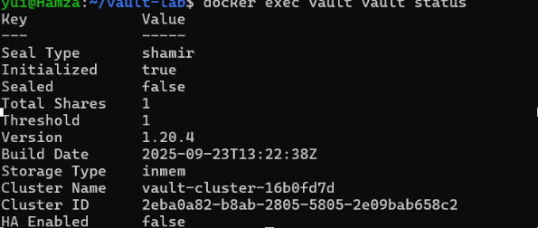

Jeg startet Vault i utviklermodus for å lære det grunnleggende. Tre ting skiller seg ut:

* **Sealed false:** Vault er åpen med en gang. I et ekte oppsett starter den låst.
* **Threshold 1:** én nøkkel er nok til å åpne Vault. I et ekte oppsett trengs flere personer.
* **Storage Type inmem:** alt ligger i minnet og forsvinner når Vault stopper.

Utviklermodus skriver også hovednøkkelen og root tokenet rett i loggen. Logger kan altså lekke passord, så de må sjekkes før man deler dem.

## 2. Ingen tilgang uten token

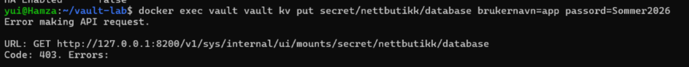

Første gang jeg prøvde å lagre et passord, fikk jeg 403. Jeg var ikke logget inn, så Vault nektet alt. Vault stenger alt til noen har fått lov.

Jeg logget inn med `vault login`. Da skrives tokenet skjult, så det ikke havner i kommandohistorikken.

## 3. Root token

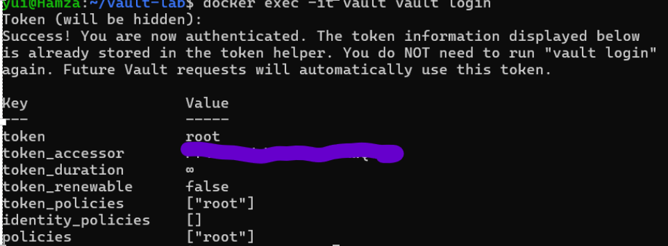

Root tokenet har full tilgang og utløper aldri. Det er det farligste en angriper kan stjele. Det bør bare brukes til å sette opp Vault. Senere i prosjektet lager jeg tokens med mindre tilgang og kort levetid.

Jeg har skjult `token_accessor` på bildet, siden den kan brukes til å slå opp tokenet.

## 4. Lagre og hente et passord

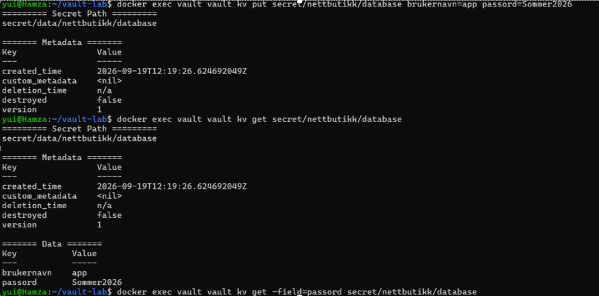

Jeg lagret et databasepassord for en tenkt nettbutikk og hentet det ut igjen. Vault la til `data/` i stien selv. Det må man huske når man skriver tilgangsregler.

## 5. Det gamle passordet fantes fortsatt

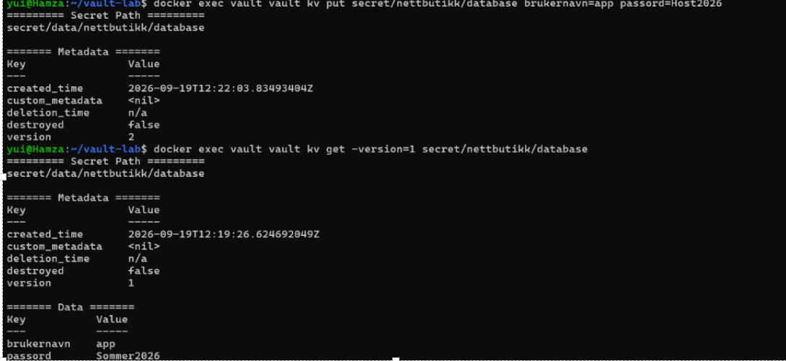

Jeg byttet passordet fra `Sommer2026` til `Host2026`. Likevel kunne jeg hente det gamle passordet. Vault tar vare på opptil ti gamle versjoner.

Det er nyttig hvis man må gå tilbake. Men hvis passordet ble byttet fordi det lekket, ligger det lekkede passordet der fortsatt.

## 6. Passordene lå i kommandohistorikken

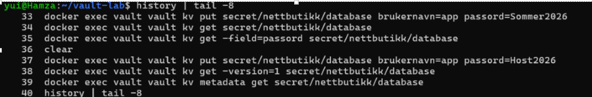

Jeg hadde skrevet passordene rett i kommandoene. Terminalen lagrer alle kommandoer, så passordene lå i klartekst i historikken. Kommandoen `clear` hjelper ikke, den tømmer bare skjermen.

Vault beskytter passordet når det først er lagret, men ikke på veien inn.

## 7. Fikset

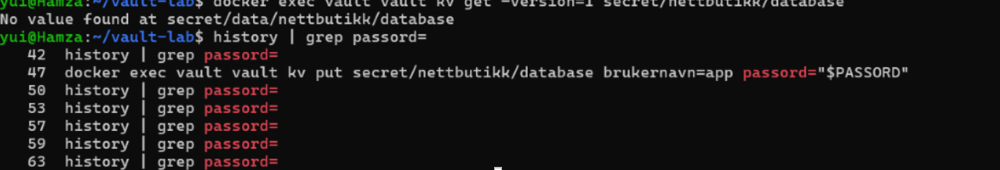

Jeg slettet det gamle passordet for godt med `kv destroy`, og satte Vault til å bare ta vare på to versjoner. Da jeg lagret et nytt passord, forsvant den gamle versjonen helt.

Jeg fant tre passord i historikken, ikke to. Det tredje kom fra en kommando som feilet. Feilede kommandoer lagres også. Jeg slettet alle tre, og bruker nå `read -s`, som skjuler det jeg skriver.

## 8. Appen får bare det den trenger

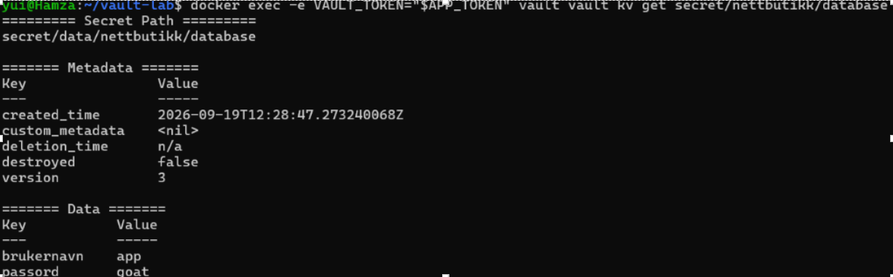

Jeg skrev en tilgangsregel som bare lar nettbutikken lese sitt eget passord. Så lagde jeg et token med denne regelen som varer i 15 minutter. Med det tokenet kunne appen lese passordet sitt.

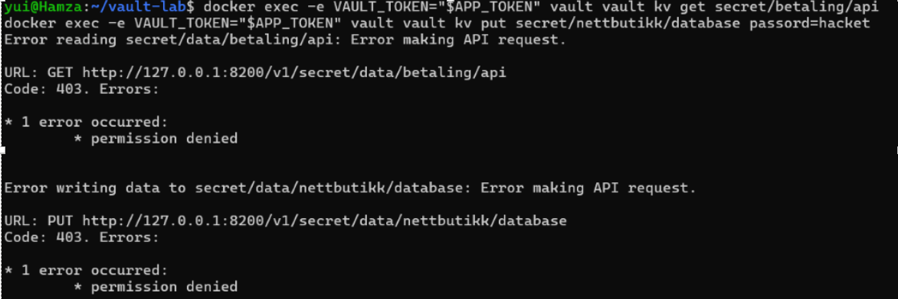

Appen fikk ikke lese betalingsnøkkelen, og den fikk ikke endre sitt eget passord. Hvis appen blir hacket, får angriperen bare det appen allerede har.

## 9. Tokenet slutter å virke

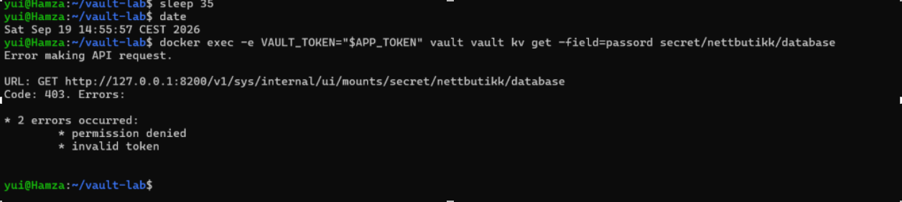

Jeg lagde et token som varer i 30 sekunder. Klokka 14:52:45 virket det. Etter 35 sekunder fikk jeg `invalid token`. Et stjålet token med kort levetid er fort verdiløst.

## 10. Logg over hvem som hentet hva

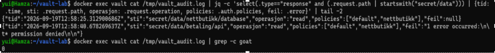

Jeg slo på loggen i Vault. Den viste begge forsøkene fra appen: ett som ble godtatt og ett som ble nektet, med tidspunkt og hvilken tilgang tokenet hadde.

Jeg søkte etter passordet i loggen og fant det ikke. Vault skriver ikke selve passordene i loggen.

## 11. Databasepassord som slettes av seg selv

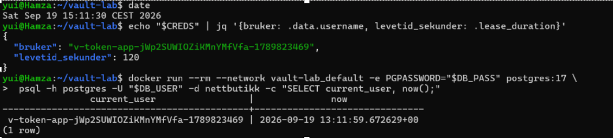

I stedet for ett fast databasepassord lot jeg Vault lage en ny databasebruker hver gang noen trenger det. Brukeren kan bare lese, og varer i to minutter. Jeg lot også Vault bytte adminpassordet til databasen, så det bare er Vault som vet det.

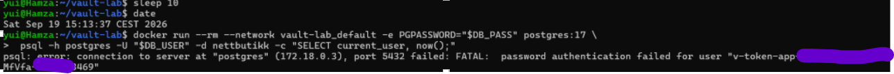

Etter to minutter virket ikke brukeren lenger. Et lekket passord blir ubrukelig av seg selv, uten at noen må oppdage lekkasjen først.

## Det jeg lærte

* Vault beskyttet passordene godt, men de lekket likevel via terminalen. Det største problemet var hvordan jeg brukte verktøyet.
* Å bytte et passord fjerner ikke det gamle.
* Kommandoer som feiler blir også lagret i historikken.
* Tokens og passord som utløper av seg selv gjør en lekkasje mye mindre farlig.
* Feilmeldingene sier mye. `permission denied` betyr manglende tilgang, `invalid token` betyr at tokenet ikke finnes lenger.

## Begrensninger

Dette er en lab, ikke et ekte oppsett:

* Vault kjører i utviklermodus
* Trafikken er ikke kryptert
* Root tokenet er satt til en kjent verdi

## Videre

* Kjøre Vault som i et ekte oppsett, låst ved oppstart og med flere nøkler
* Slette root tokenet etter oppsett
* Kryptere trafikken
* Varsle når noen blir nektet mange ganger

## Kjør selv

Du trenger Docker med Compose.

```bash
git clone https://github.com/Hmz2k/vault-lab.git
cd vault-lab

read -s -p "Database adminpassord: " PG
echo "POSTGRES_PASSWORD=$PG" > .env
unset PG
chmod 600 .env

docker compose up -d
docker exec -it vault vault login
docker exec -i vault vault policy write nettbutikk - < policies/nettbutikk.hcl
docker exec vault vault audit enable file file_path=/tmp/vault_audit.log
```

Resten av stegene står i [ARBEIDSLOGG.md](ARBEIDSLOGG.md).

## Rydde opp

```bash
docker compose down
```
