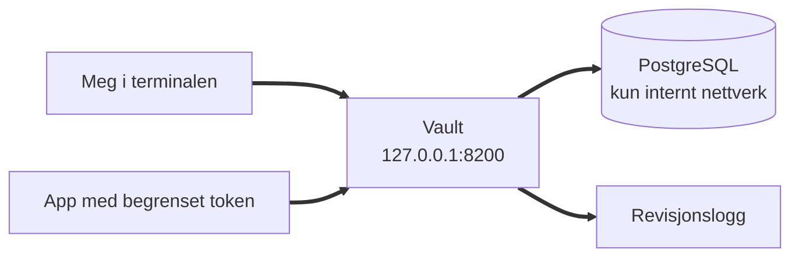

# Vault Lab: sikker håndtering av hemmeligheter

Et praktisk prosjekt der jeg setter opp HashiCorp Vault og PostgreSQL i Docker, finner og utbedrer måter hemmeligheter lekker på, begrenser tilgang med policyer og lar Vault lage databasepassord som slettes automatisk.

> Alle passord, nøkler og brukernavn i prosjektet er falske og laget kun for denne labben.

## Problemet

Lekkede passord er en av de vanligste årsakene til sikkerhetsbrudd. Passord ligger i kode og konfigurasjonsfiler, deles mellom mange, byttes sjelden og ingen vet hvem som har brukt dem. Målet med prosjektet var å forstå hvordan et verktøy for håndtering av hemmeligheter løser dette i praksis, og hvor svakhetene ligger.

## Oppsett



* **Vault 1.20** i Docker, kun tilgjengelig fra min egen maskin
* **PostgreSQL 17** uten eksponerte porter, kun tilgjengelig fra Docker nettverket
* **Policyer** lagret som kode i `policies/`
* Testet på Windows 11 med WSL 2, Ubuntu og Docker 29

## Resultater

### 1. Utgangspunkt: Vault i utviklermodus


Jeg startet Vault 1.20 i utviklermodus med Docker Compose for å lære det grunnleggende. Statusen viser tre ting jeg merket meg:

* **Sealed false:** Vault starter ulåst. I et produksjonsoppsett starter den alltid forseglet og må låses opp med nøkler.
* **Threshold 1:** én enkelt nøkkel er nok til å låse opp. I produksjon deles nøkkelen slik at ingen person kan åpne Vault alene.
* **Storage Type inmem:** alt lagres i minnet og forsvinner når containeren stopper.

Jeg la også merke til at utviklermodus skriver unseal key og root token i klartekst i loggen. Det viste meg at logger også kan lekke hemmeligheter, og derfor sjekker jeg alltid logger før jeg deler dem.

### 2. Ingen tilgang uten token


Mitt første forsøk på å lagre en hemmelighet ble avvist med 403 Forbidden. Kommandoen ble sendt uten token, så Vault visste ikke hvem jeg var. Feilen kom allerede før noe ble lagret: kommandoen spør først Vault hva slags lager som finnes på stien, og selv det ble nektet. Vault stenger alt som standard til noen eksplisitt har fått tilgang.

Jeg løste det ved å logge inn med `vault login`. Da skrives tokenet skjult, i stedet for rett i kommandoen, slik at det ikke havner i kommandohistorikken min.

### 3. Innlogging med root token


Etter innlogging viser Vault hvilke rettigheter tokenet har. Policyen er **root**, som betyr full tilgang til alt, og **token_duration** er uendelig, så tokenet utløper aldri. Et token som kan alt og varer evig er det mest verdifulle en angriper kan stjele. I et produksjonsoppsett skal root token kun brukes til første oppsett og deretter tilbakekalles. Videre i prosjektet lager jeg egne tokens med begrensede rettigheter og kort levetid.

Jeg har sladdet token_accessor. Den gir ikke tilgang i seg selv, men kan brukes til å slå opp og tilbakekalle tokenet, og slike verdier deler jeg ikke offentlig.

### 4. Lagre og hente en hemmelighet


Jeg lagret et databasepassord for en tenkt nettbutikk med `kv put`, og hentet det ut igjen med `kv get`. Vault svarte med stien `secret/data/nettbutikk/database`, selv om jeg skrev `secret/nettbutikk/database`. Grunnen er at lageret er KV versjon 2, som skiller mellom selve dataene under `data/` og informasjon om dem under `metadata/`. Det måtte jeg ta hensyn til senere da jeg skrev tilgangspolicyer.

En app trenger bare selve verdien, så jeg hentet også passordet alene med `kv get -field=passord`.

### 5. Gamle versjoner kan fortsatt hentes


Jeg oppdaterte databasepassordet fra `Sommer2026` til `Host2026`. Vault overskrev ikke den eksisterende verdien, men lagret endringen som versjon 2. Da jeg deretter hentet versjon 1, fikk jeg fortsatt ut det opprinnelige passordet i klartekst.

KV versjon 2 beholder som standard opptil ti tidligere versjoner av hver hemmelighet. Det er nyttig dersom et passordbytte må rulles tilbake, men dersom et passord byttes fordi det er kompromittert, vil det kompromitterte passordet fortsatt være tilgjengelig for alle med lesetilgang til stien. Et passordbytte er ikke fullført før den gamle versjonen er fjernet.

### 6. Passord eksponert i kommandohistorikken


Da jeg gjennomgikk kommandohistorikken, fant jeg begge passordene i klartekst. Jeg hadde skrevet dem direkte i kommandoen, og Bash lagrer alle kommandoer i `~/.bash_history`. Enhver med tilgang til brukerkontoen min kunne dermed lest passordene uten å være i nærheten av Vault. Jeg observerte også at `clear` kun tømmer skjermen og ikke påvirker historikken.

Funnet viser at sikkerhet må vurderes for hele kjeden. Vault beskytter hemmeligheter fra det øyeblikket de er lagret, men kan ikke beskytte dem på veien inn.

### 7. Utbedring verifisert


Jeg slettet den kompromitterte versjonen permanent med `kv destroy`. Til forskjell fra `kv delete`, som kun skjuler en versjon og kan reverseres, fjerner `destroy` selve dataene. Jeg begrenset også antall lagrede versjoner til to, og da jeg senere lagret en ny versjon, fjernet Vault versjon 1 helt.

Et søk i kommandohistorikken avdekket tre forekomster av passord, ikke to som jeg først antok. Den tredje stammet fra forsøket som feilet med 403. Kommandoer lagres uavhengig av om de lykkes, så et systematisk søk er nødvendig. Etter oppryddingen gjenstår kun én lagringskommando, og den bruker variabelen `$PASSORD`. Jeg leser nå passord inn med `read -s`, som skjuler inndata, slik at selve verdien aldri skrives til historikken.

### 8. Tilgang styrt av policy


Jeg skrev en policy for nettbutikken som kun gir lesetilgang til `secret/data/nettbutikk/*`, og lastet den inn fra filen [`policies/nettbutikk.hcl`](policies/nettbutikk.hcl). Policyen ligger versjonskontrollert i repoet, slik at endringer i tilgang kan spores. Deretter opprettet jeg et token knyttet til policyen med en levetid på 15 minutter.

Med appens token kunne jeg lese databasepassordet. Tokenet ble lagret i en variabel og sendt inn med `VAULT_TOKEN`, slik at verdien aldri ble vist eller lagret i historikken. Til forskjell fra root tokenet kan dette tokenet kun lese én sti og slutter å virke etter kort tid.


Deretter testet jeg to handlinger appen ikke skal ha tilgang til. Forsøket på å lese betalingsnøkkelen under `secret/betaling/api` ble avvist, fordi stien ikke er nevnt i policyen. Forsøket på å overskrive nettbutikkens eget passord ble også avvist, selv om appen har tilgang til stien, fordi policyen kun gir lesetilgang.

Policyen avgrenser dermed både hvilke hemmeligheter appen kan nå, og hva den kan gjøre med dem. Dersom appen blir kompromittert, kan en angriper verken hente andre systemers hemmeligheter eller endre passordet for å låse ute legitime brukere.

### 9. Tokenet utløper av seg selv


Jeg opprettet et token med samme policy og en levetid på 30 sekunder. Klokken 14:52:45 kunne tokenet lese databasepassordet. Etter 35 sekunder ble samme forespørsel avvist med `invalid token`.

Feilmeldingen skiller seg fra policytesten. Der var tokenet gyldig, men manglet tilgang. Her har Vault fjernet tokenet helt. Et stjålet token med kort levetid gir en angriper et svært begrenset tidsvindu.

### 10. Revisjonslogg


Jeg aktiverte revisjonsloggen og gjentok de to forsøkene med appens token. Loggen registrerte begge forespørslene med tidspunkt, sti, operasjon og hvilke policyer tokenet hadde. Det tillatte forsøket har ingen feil, mens forsøket på å lese betalingsnøkkelen er registrert med `permission denied`. I en reell hendelse er det slik man sporer hva en kompromittert applikasjon har forsøkt å hente.

Et søk etter passordet i loggfilen ga null treff. Vault erstatter sensitive verdier med en HMAC før de skrives. Loggen dokumenterer at en hemmelighet ble hentet, uten selv å bli et nytt sted der hemmeligheten kan lekke.

### 11. Dynamiske databasepassord


I stedet for ett fast databasepassord som deles av alle, koblet jeg Vault til PostgreSQL og lot Vault opprette databasebrukere ved behov. Hver bruker får kun lesetilgang og en levetid på to minutter. Etter oppsettet lot jeg Vault bytte databasens administratorpassord, slik at kun Vault kjenner det. Ingen person har lenger administratortilgang til databasen.

Jeg ba Vault om en bruker og logget inn fra en separat container på samme nettverk, slik en applikasjon ville gjort. Brukernavnet ble generert av Vault i samme øyeblikk, og passordet ble aldri vist på skjermen.


Etter at levetiden var passert, ble samme brukernavn og passord avvist. Et lekket passord er dermed verdiløst etter kort tid, uten at noen trenger å oppdage lekkasjen eller bytte passordet manuelt. PostgreSQL returnerer samme feilmelding uavhengig av om brukeren finnes, slik at feilmeldingen ikke kan brukes til å kartlegge gyldige brukernavn.

## Hva jeg lærte

* **Verktøyet er bare én del av kjeden.** Vault beskyttet hemmelighetene godt, men de lekket likevel via kommandohistorikken før de kom inn. Den største risikoen lå i hvordan jeg brukte verktøyet.
* **Å bytte et passord er ikke det samme som å fjerne det gamle.** Versjonering er nyttig, men krever bevisst opprydding.
* **Feilede kommandoer lagres også.** Jeg fant et passord i historikken jeg ikke husket å ha skrevet, fordi kommandoen hadde feilet. Jeg søker nå systematisk i stedet for å stole på hukommelsen.
* **Kort levetid begrenser skaden.** Tokens og databasepassord som utløper av seg selv gjør at en lekkasje ikke trenger å bli oppdaget for å bli uskadeliggjort.
* **Feilmeldinger forteller mye.** Forskjellen på `permission denied` og `invalid token` viste om problemet var manglende tilgang eller et token som ikke lenger finnes.
* **Små feil underveis:** jeg skrev `wsl -install` med én bindestrek, glemte `apt update`, fikk `permission denied` mot `docker.sock` fordi brukeren ikke var i docker gruppen, og opplevde at `read -s` tok imot neste innlimte linje som passord. Alle ble løst, og alle lærte meg noe om hvordan verktøyene fungerer.

## Begrensninger

Dette er et laboratorium, ikke et produksjonsoppsett. Bevisste forenklinger:

* Vault kjører i utviklermodus med lagring i minnet, ulåst oppstart og én nøkkel
* Trafikken er ikke kryptert med TLS, verken mot Vault eller mot databasen (`sslmode=disable`)
* Root token er satt til en kjent verdi i `compose.yaml`
* Verdier sendt som argument til `docker exec` er kortvarig synlige i prosesslisten

## Videre arbeid

* Produksjonslikt oppsett med varig lagring, forseglet oppstart og nøkkel delt i fem der tre må til
* Tilbakekalle root token etter oppsett og bruke AppRole for applikasjoner
* TLS mellom alle komponenter
* Overvåke revisjonsloggen med en SIEM og varsle ved gjentatte nektede forsøk

## Kjør selv

Krever Docker med Compose.

```bash
git clone <repo>
cd vault-lab

# Adminpassord til databasen, skrives skjult
read -s -p "Database adminpassord: " PG
echo "POSTGRES_PASSWORD=$PG" > .env
unset PG
chmod 600 .env

docker compose up -d
docker exec -it vault vault login        # token: root

# Policy
docker exec -i vault vault policy write nettbutikk - < policies/nettbutikk.hcl

# Revisjonslogg
docker exec vault vault audit enable file file_path=/tmp/vault_audit.log
```

Oppsettet av databasemotoren og testene er beskrevet steg for steg i [ARBEIDSLOGG.md](ARBEIDSLOGG.md).

## Opprydding

```bash
docker compose down
```

Siden Vault kjører i utviklermodus og databasen ikke har varig lagring, forsvinner alle data når containerne fjernes.
